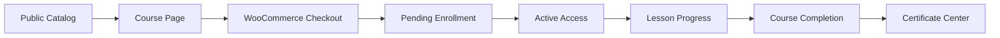

<p align="center">
  
</p>

<h1 align="center">Pressplay LMS</h1>

<p align="center">
  A commerce-ready LMS plugin for WordPress that connects catalog, checkout, protected lessons, student operations, progress tracking, and certificates in one product flow.
</p>

<p align="center">
  
  
  
  
  
</p>

<p align="center">
  
  
  
  
  
</p>

---

## Quick View

| Area | Summary |
| --- | --- |
| Product goal | Turn WordPress + WooCommerce into a complete online-course business flow |
| Best fit | Teams that want a branded student experience instead of relying on `wp-admin` |
| Main outcomes | Catalog, sales page, protected lessons, student library, certificates, enrollment operations |
| Engineering focus | WordPress architecture, WooCommerce lifecycle hooks, custom routes, access control, theme compatibility |

---

## Why It Exists

Most LMS setups inside WordPress feel fragmented:

- checkout lives in one plugin
- course content lives in another
- student accounts feel generic
- certificates feel bolted on
- support and enrollment operations are weak after payment

Pressplay LMS was built to make the full buyer and student journey feel like one product.

---

## Core Capabilities

| Icon | Capability | What it delivers |
| :--: | --- | --- |
| 🛒 | Course commerce | Syncs courses with WooCommerce products and uses real checkout and order state transitions |
| 🔒 | Access control | Handles pending, active, blocked, expired, refunded, cancelled, and failed enrollments |
| 🎓 | Learning flow | Serves custom course and lesson routes, progress tracking, and resume behavior |
| 🧾 | Certificates | Unlocks certificate output only after real completion rules are satisfied |
| 👤 | Student area | Provides a custom library, profile editing, avatar upload, and password management |
| 🛠️ | Admin operations | Supports extensions, reactivation, filtering, preview flows, and enrollment management |

---

## Product Flow



---

## Frontend Routes

| Route | Purpose |
| --- | --- |
| `/cursos/` | Public course catalog |
| `/curso/{course-slug}/` | Course landing page and purchase entry point |
| `/curso/{course-slug}/aula/{lesson-slug}/` | Protected lesson experience |
| `/meus-cursos/` | Student library and main dashboard |
| `/meus-cursos/certificados/` | Certificate center |
| `/meus-cursos/certificado/{course-slug}/` | Individual certificate output |
| `/perfil/` | Student account page |
| `/perfil/trocar-senha/` | Password management |
| `/cadastro/` | Purpose-built student registration |

---

## Architecture Snapshot

```text
pressplay_lms/
├── assets/        # Frontend and admin CSS, JS, logo, SVG material icons
├── docs/          # Collaboration and maintenance documentation
├── includes/
│   ├── Core/      # Bootstrap, activation, dependencies, rewrites, templates, assets
│   ├── Support/   # Shared helpers
│   └── *.php      # Domain modules such as Woo, Frontend, Enrollments, Progress
├── templates/
│   ├── certificado/
│   ├── frontend/
│   └── panel/
├── pressplay-lms.php
└── uninstall.php
```

### Structure Notes

- The current folder layout is already professional for a medium-sized WordPress plugin.
- `includes/Core` keeps infrastructure separate from business modules.
- `includes/*.php` keeps major LMS domains shallow and easy to locate.
- `templates/frontend`, `templates/panel`, and `templates/certificado` make rendering intent obvious.
- `assets/` is split by file type, which stays intuitive for maintenance and handoff.

### Future Scaling Path

If the plugin grows substantially, the next evolution would be grouping the flat modules inside `includes/` into folders such as:

- `Admin/`
- `Domain/`
- `Frontend/`
- `Integrations/`

That refactor is worth doing only when ownership and file count justify the extra nesting.

---

## Main Modules

| Module | Responsibility |
| --- | --- |
| `Frontend.php` | Virtual routes, course rendering, lesson rendering, catalog, student dashboard, registration |
| `Woo.php` | Product sync, add-to-cart validation, checkout bootstrap, order-based activation and revocation |
| `Enrollments.php` | Access rules, statuses, expiration windows, reactivation, extension |
| `Progress.php` | Lesson completion, course summaries, resume logic |
| `Certificate.php` | Completion validation, placeholder rendering, admin preview, student certificate output |
| `Actions.php` | Form handlers, AJAX, password updates, enrollment CTA flow |
| `Settings.php` | Admin settings, enrollment panels, CSS customization tooling |

---

## Tech Stack

| Technology | Usage |
| --- | --- |
| WordPress | Plugin runtime, CPTs, hooks, admin UI, rewrite integration |
| WooCommerce | Product, cart, checkout, and order lifecycle |
| PHP 8+ | Domain logic, rendering, integrations, validation |
| Vimeo API | Optional metadata, duration, thumbnail, and embed handling |
| Theme compatibility layer | Native header and footer rendering with the active theme |

---

## Payment Compatibility

Pressplay LMS now follows the WooCommerce payment lifecycle instead of relying on a gateway-specific integration.

- activation listens to `woocommerce_payment_complete`
- paid access also reacts to WooCommerce paid statuses through `wc_get_is_paid_statuses()`
- access revocation reacts to invalid order states such as cancelled, failed, and refunded
- the enrollment record stores the actual WooCommerce payment method used on the order

This keeps the LMS compatible with gateways that correctly update WooCommerce orders, including common setups such as PayPal, Mercado Pago, PagBank/PagSeguro, Stripe, and other well-behaved WooCommerce payment extensions.

Reference notes: [`docs/PAYMENT_COMPATIBILITY.md`](docs/PAYMENT_COMPATIBILITY.md)

---

## Developer Docs

- Collaboration guide: [`docs/DEVELOPER_GUIDE.md`](docs/DEVELOPER_GUIDE.md)
- Release guide: [`docs/RELEASING.md`](docs/RELEASING.md)
- Payment compatibility notes: [`docs/PAYMENT_COMPATIBILITY.md`](docs/PAYMENT_COMPATIBILITY.md)

Use the developer guide as the baseline for:

- architecture decisions
- activation and deactivation behavior
- security-sensitive areas
- release checks
- contribution workflow

---

## Installation

1. Copy the plugin into the WordPress plugins directory.
2. Activate the plugin in WordPress.
3. Make sure WooCommerce is active.
4. Save permalinks once if the custom LMS routes need refreshing.

---

## Basic Usage

1. Create a course.
2. Add lessons and a teacher.
3. Configure pricing and access rules.
4. Publish the course.
5. Let students register, purchase, progress through lessons, and generate certificates.
